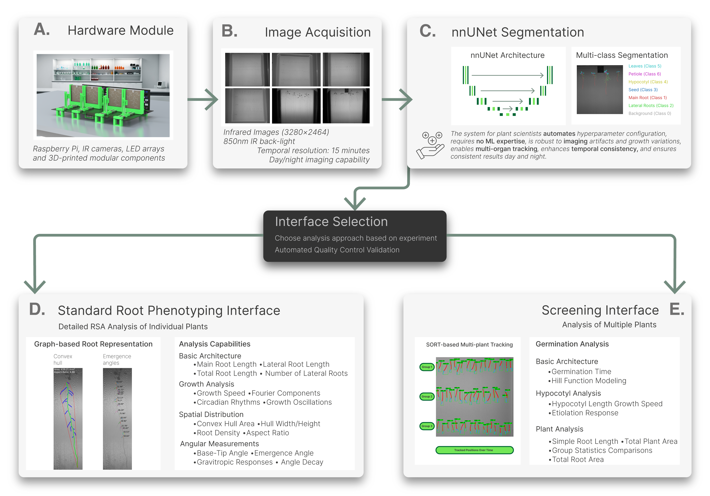

# ChronoRoot 2.0

ChronoRoot 2.0 is an automated pipeline for plant root phenotyping from time-lapse infrared images. It combines AI-powered segmentation (nnUNet) with graph-based root architecture analysis across two analysis interfaces.



## Applications

| App | Description |
|-----|-------------|
| **ChronoRoot Segmentation** | Segments infrared images into 6 root structure classes using nnUNet |
| **ChronoRoot Analysis** | Detailed RSA analysis of individual plants (graph-based, RSML export) |

---

## Installation (macOS)

> **Requirements:** macOS 12 or later, Intel or Apple Silicon (M-series).
> NVIDIA GPU acceleration is not available on macOS — segmentation runs on CPU.

### Step 1 — Download or clone the repository

```bash
git clone <repo-url>
cd ArabidopsisAnalysis
```

### Step 2 — Run the installer

```bash
bash installer_conda_mac.sh
```

The installer will automatically:

1. **Detect your Mac architecture** (Apple Silicon or Intel) and note that NVIDIA GPU is not available on macOS.
2. **Install Miniconda** (if not already installed) — downloads the correct build for your architecture and installs it silently to `~/miniconda3`. You will be prompted to restart your terminal once after this step.
3. **Install Homebrew and libzbar** (if Homebrew is already installed) — `libzbar` is required for QR code plate identification. If Homebrew is missing, the installer will warn you and ask whether to continue without QR support.
   - To install Homebrew first: visit [https://brew.sh](https://brew.sh)
4. **Create the `ChronoRoot` Conda environment** from `environment.yml`, which includes:
   - Python 3.13, PyQt5, NumPy, OpenCV, scikit-image, scikit-fda, nnUNetv2, and all other dependencies.
   - If the environment already exists, it updates it in place.
5. **Download segmentation model weights** from Hugging Face into `segmentationApp/models/`.
6. **Create macOS `.app` launchers** in `~/Applications/` with desktop shortcuts on `~/Desktop/`:
   - `ChronoRoot Analysis.app`
   - `ChronoRoot Segmentation.app`

### Step 3 — First launch (Gatekeeper)

macOS will block unsigned apps by default. To open either app for the first time:

1. **Right-click** the `.app` on the Desktop (or in `~/Applications/`).
2. Select **Open**.
3. Click **Open** in the confirmation dialog.

You only need to do this once per app.

---

## Running from the Terminal

Activate the environment and launch any app directly:

```bash
conda activate ChronoRoot

# Standard single-plant analysis interface
cd singlePlantAnalysis
python run.py

# Segmentation module
cd segmentationApp
python run.py
```

---

## Updating Model Weights

If you need to re-download or update the segmentation model weights:

```bash
conda activate ChronoRoot
cd segmentationApp
chmod +x download_weights.sh
./download_weights.sh
```

---

## Other Platforms

| Platform | Installer |
|----------|-----------|
| Linux (Conda) | `bash installer_conda_linux.sh` |
| Windows (WSL2) | `bash installer_conda_wsl.sh` |

Linux and WSL installers support NVIDIA CUDA GPU acceleration for segmentation.

---

## Directory Structure

```
ArabidopsisAnalysis/
├── singlePlantAnalysis/       # Standard Root Phenotyping Interface
├── segmentationApp/           # nnUNet Segmentation Module
├── Documents/                 # Images and documentation assets
├── environment.yml            # Conda environment specification
├── installer_conda_mac.sh     # macOS installer (this guide)
├── installer_conda_linux.sh   # Linux installer
└── installer_conda_wsl.sh     # Windows WSL2 installer
```

---

## Troubleshooting

**`conda` command not found after install**
Close and reopen your terminal, then try again. The installer adds conda to your shell profile, but it takes effect on the next session.

**QR code detection not working**
Ensure `libzbar` is installed via Homebrew: `brew install zbar`. The `DYLD_LIBRARY_PATH` in the `.app` launcher points to `/opt/homebrew/lib` automatically.

**Segmentation is slow**
Expected on macOS — nnUNet runs on CPU. For GPU-accelerated segmentation, use a Linux machine with a CUDA-capable GPU and the Linux installer.

**App won't open / "damaged" warning**
Run `xattr -cr ~/Desktop/"ChronoRoot Analysis.app"` (or the Segmentation app) in the terminal to clear the quarantine flag, then try opening again.
