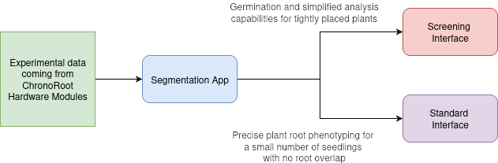

# ChronoRoot 2.0


[](http://arxiv.org/abs/2504.14736)
[](LICENSE)
[](https://hub.docker.com/r/ngaggion/chronoroot)
[](https://huggingface.co/ngaggion/models)

## An Open AI-Powered Platform for 2D Temporal Plant Phenotyping

**ChronoRoot 2.0** is an integrated open-source platform that combines affordable hardware with advanced artificial intelligence to enable sophisticated temporal plant phenotyping. 

Depending on your research needs, the system offers two distinct workflows: a **Detailed Analysis** for individual plant architecture or a **High-Throughput Screening** for analyzing large populations.

### Key Features
* **Multi-organ tracking:** Segment and track six distinct plant structures (main root, lateral roots, seed, hypocotyl, leaves, and petiole).
* **Deep Learning Integration:** Powered by nnU-Net for robust segmentation.
* **Novel Metrics:** Comprehensive measurements including gravitropic response parameters.
* **Quality Control:** Interfaces designed for real-time human-in-the-loop validation.

## Workflow Overview



A typical ChronoRoot 2.0 experiment follows this pipeline:

1.  **Data Acquisition**: Capture temporal image sequences (typically every 15 mins) using the [ChronoRoot Hardware](https://github.com/ThomasBlein/ChronoRootModuleHardware).
2.  **Segmentation**: Process raw images using the **Segmentation App**. This utilizes GPU acceleration to automatically identify plant organs.
3.  **Analysis**: Load the segmented data into one of the analysis interfaces:
    * **ChronoRoot App**: For detailed architectural analysis of individual plants.
    * **Screening App**: For high-throughput automated analysis of multiple plants.
4.  **Reporting**: Export statistical analysis, visualizations, and group comparisons.

## System Requirements

Before installing, ensure your system meets the following criteria:

| Component | Requirement |
| :--- | :--- |
| **OS** | **Linux** (Ubuntu 20.04+), **Windows 10** (via WSL2), or **macOS** (Docker only) |
| **RAM** | 8 GB minimum (16 GB recommended) |
| **Storage** | ~15 GB (Disk space for images/containers) |
| **GPU** | NVIDIA GPU with CUDA 11.0+ (Highly recommended for Segmentation) |

> **Note on macOS:** Native installation is not supported. Mac users must use the Docker method.

## Installation & Getting Started

ChronoRoot 2.0 offers automated installers that set up the environment and create **Desktop Shortcuts** for a point-and-click experience. Choose the method that best fits your setup.

Both native and apptainer installations provide three applications, with shortcuts as follows:

| Icon | Application | Description |
| --- | --- | --- |
|  | **ChronoRoot App** | Standard detailed architectural analysis. |
|  | **ChronoRoot Screening** | High-throughput automated screening. |
|  | **ChronoRoot Segmentation** | nnU-Net image segmentation. | 

### Option 1: Native / Conda Installation (Recommended)
*Best for: Personal computers (Linux or Windows WSL) where you want desktop integration.*

#### **A. For Ubuntu / Linux**
```bash
wget https://raw.githubusercontent.com/chronoroot/ChronoRoot2/master/installer_conda_linux.sh
bash installer_conda_linux.sh
```

#### **B. For Windows (via WSL2)**

1. Ensure WSL2 is installed and open your Ubuntu terminal.
2. Run the following:

```bash
wget https://raw.githubusercontent.com/chronoroot/ChronoRoot2/master/installer_conda_wsl.sh
bash installer_conda_wsl.sh
```

### Option 2: Apptainer / Singularity

*Best for: HPC Clusters or users preferring single-file containers.*

#### **Linux Apptainer**

```bash
wget https://raw.githubusercontent.com/chronoroot/ChronoRoot2/master/apptainerInstaller/installer_linux.sh
bash installer_linux.sh
```

#### **Windows Apptainer (WSL)**

```bash
wget https://raw.githubusercontent.com/chronoroot/ChronoRoot2/master/apptainerInstaller/installer_windows.sh
bash installer_windows.sh
```

### Option 3: Docker

*Best for: macOS users or advanced sandbox environments.*

If you are using Docker, you will interact with the software via the terminal.

**1. Pull the Image:**

```bash
docker pull ngaggion/chronoroot:latest
```

**2. Run the Container:**

**Linux:**

```bash
xhost +local:docker
MOUNT="YOUR_LOCAL_DATA_PATH"

docker run -it --gpus all \
    -u $(id -u):$(id -g) \
    -v /etc/passwd:/etc/passwd:ro \
    -v /etc/group:/etc/group:ro \
    -v $MOUNT:/DATA/ \
    -e DISPLAY=$DISPLAY \
    -v /tmp/.X11-unix:/tmp/.X11-unix \
    --shm-size=8gb \
    ngaggion/chronoroot:latest
```

**Windows (WSL2):**

```bash
MOUNT="/mnt/c/path/to/your/data"
# Ensure X Server (like VcXsrv) is running if not using WSLg

docker run -it --gpus all \
    -u $(id -u):$(id -g) \
    -v /etc/passwd:/etc/passwd:ro \
    -v /etc/group:/etc/group:ro \
    -v $MOUNT:/DATA/ \
    -v /tmp/.X11-unix:/tmp/.X11-unix \
    -v /mnt/wslg:/mnt/wslg \
    -e DISPLAY -e WAYLAND_DISPLAY -e XDG_RUNTIME_DIR -e PULSE_SERVER \
    --shm-size=8gb \
    ngaggion/chronoroot:latest
```

**3. Docker CLI Commands:**
Once inside the container, use these aliases to launch the apps:

* `segmentation` : Launches Segmentation App
* `chronoroot` : Launches Standard Interface
* `screening` : Launches Screening Interface

## Note on Segmentation Models

The pre-trained nnU-Net weights are now hosted on **[Hugging Face](https://huggingface.co/ngaggion/models)** to keep the repository lightweight. The installers above will ask to download them automatically.

If you need to update them later manually, run:
```bash
cd segmentationApp
./download_weights.sh
```

## Documentation & Tutorials

For comprehensive, step-by-step guides, please visit our **[Official Documentation Website](https://chronoroot.github.io/)**.

### Step-by-Step Tutorials
We have migrated our tutorials to the web to provide detailed, up-to-date instructions.

* **Standard Interface (Detailed Analysis)**
    * [Tutorial: Arabidopsis Analysis](https://chronoroot.github.io/tutorials/standard/)
    * [Tutorial: Tomato Analysis](https://chronoroot.github.io/tutorials/standard_tomato/)
* **Screening Interface (High-Throughput)**
    * [Tutorial: Hypocotyl Etiolation](https://chronoroot.github.io/tutorials/screening_hypocotyl/)
    * [Tutorial: Seed Germination](https://chronoroot.github.io/tutorials/screening_germination/)
* **AI Segmentation**
    * [Segmentation Module Usage](https://chronoroot.github.io/tutorials/segmentation/)
    * [Guide: Train Your Own Model](https://chronoroot.github.io/tutorials/training_on_your_images/)
* **Infrastructure**
    * [Docker Installation & Usage](https://chronoroot.github.io/tutorials/docker/)

### Demo Data
We provide a pre-packaged dataset to help you follow along with the tutorials above.

* **Docker/Apptainer:** Pre-loaded at `/Demo/` inside the container.
* **Download:** [Google Drive Link](https://drive.google.com/drive/folders/1PJCn_MMHcM9KPgz8dYe1F2Cvdt43FS3Z?usp=sharing)

## Repository Structure

```text
ChronoRoot2
├── apptainerInstaller         # Scripts for Singularity deployment
├── chronoRootApp              # Standard Root Phenotyping Interface
├── chronoRootScreeningApp     # High-throughput Screening Interface
├── segmentationApp            # AI-based segmentation tools (nnUNet)
├── Docker                     # Dockerfile and instructions
├── Documents                  # Legacy PDF documentation
├── environment.yml            # Conda environment spec
├── environment_no_nnunet.yml  # Conda environment spec without nnU-Net
├── installer_conda_linux.sh   # Linux native installer script
├── installer_conda_wsl.sh     # WSL native installer script
├── logo.ico                   # ChronoRoot icon
├── logo_screening.ico         # ChronoRoot Screening icon
├── logo_seg.ico               # ChronoRoot Segmentation icon
├── LICENSE                    # GNU GPL v3.0
└── README.md                  # This file
```

For technical details on specific modules, please refer to their internal documentation:

* [Standard Interface Docs](chronoRootApp/README.md) 
* [Screening Interface Docs](chronoRootScreeningApp/README.md) 
* [Segmentation Module Docs](segmentationApp/README.md) 
* [Docker Guide](Docker/README.md) 

## Hardware Specifications

ChronoRoot 2.0 is designed to work with an affordable custom hardware setup that includes:

- Raspberry Pi 3B computer
- Fixed-zoom cameras (RaspiCam v2)
- Infrared LED backlighting
- 3D-printed and laser-cut components

For detailed hardware specifications and assembly instructions, see the [ChronoRootModuleHardware repository](https://github.com/ThomasBlein/ChronoRootModuleHardware).

For the controller software for the Raspberry Pi 3B, see the [ChronoRoot Module Controller repository](https://github.com/ThomasBlein/ChronoRootControl).

## Citation

If you use this platform in your research, please cite:

```bibtex
@article{gaggion2026chronoroot,
  title={ChronoRoot 2.0: An Open AI-Powered Platform for 2D Temporal Plant Phenotyping}, 
  author={Nicolás Gaggion and Noelia A. Boccardo and Rodrigo Bonazzola and María Florencia Legascue and María Florencia Mammarella and Florencia Sol Rodriguez and Federico Emanuel Aballay and Florencia Belén Catulo and Andana Barrios and Luciano J. Santoro and Franco Accavallo and Santiago Nahuel Villarreal and Leonardo I. Pereyra-Bistrain and Moussa Benhamed and Martin Crespi and Martiniano María Ricardi and Ezequiel Petrillo and Thomas Blein and Federico Ariel and Enzo Ferrante},
  journal={arXiv preprint arXiv:2504.14736},
  year={2026}
}
```

### Contact & License

ChronoRoot 2.0 is released under the [GNU General Public License v3.0](https://www.google.com/search?q=LICENSE).
For support, please [open an issue](https://github.com/ngaggion/ChronoRoot2/issues).
