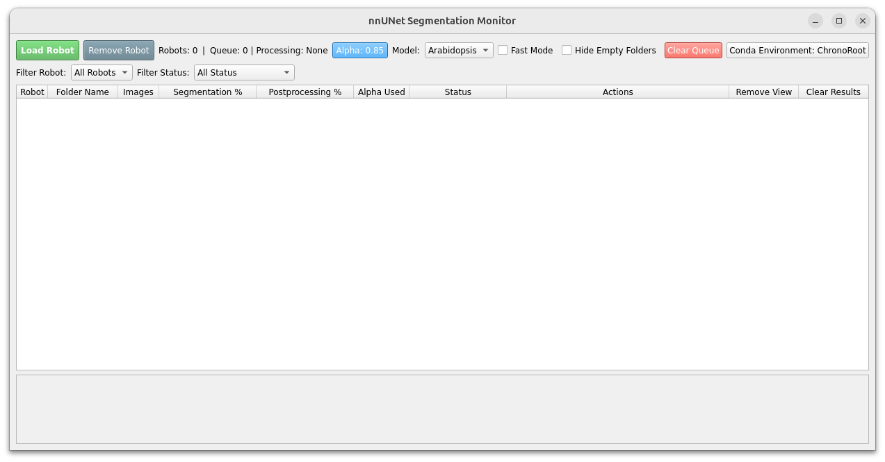

# ChronoRoot 2.0 - Segmentation Module

[](https://huggingface.co/ngaggion/models)

This directory contains the AI-powered segmentation module for ChronoRoot 2.0, designed to automatically identify plant root structures from images.

## Overview

The segmentation module uses a deep learning model to analyze infrared images and identify six distinct plant structures:

1.  **Main root** (primary root axis)
2.  **Lateral roots** (secondary roots)
3.  **Seed** (pre- and post-germination structures)
4.  **Hypocotyl** (stem region between root-shoot junction and cotyledons)
5.  **Leaves** (including both cotyledons and true leaves)
6.  **Petiole** (leaf attachment structures, not available in Tomato model)

This application provides both a graphical user interface (GUI) and command-line interface (CLI) to manage and run segmentation and post-processing tasks on large datasets.

### Directory Structure

```text
segmentationApp/
├── bash_usage.sh             # Example bash script for demo processing
├── cli.py                    # Command-line interface for quick processing
├── config.json               # Stores user settings (Conda env, alpha, etc.)
├── download_weights.sh       # SCRIPT: Syncs model weights from Hugging Face
├── models/                   # Contains pre-trained nnUNet models
│   ├── Arabidopsis/          # (Populated after running download_weights.sh)
│   │   ├── dataset.json
│   │   ├── plans.json
│   │   └── fold_0/
│   │       └── checkpoint_final.pth
│   └── Tomato/
│       ├── dataset.json
│       ├── plans.json
│       └── fold_0/
│           └── checkpoint_final.pth
├── nnUNet_wrapper.py         # Internal script for nnUNet
├── postprocess.py            # Script for temporal post-processing
├── README.md                 # This file
├── run.py                    # The main GUI application
├── screenshots/
│   └── MainScreen.png        # Screenshot of the GUI interface
└── trainerOrganization/      # Tools for training custom models
    ├── CreateArabidopsisDataset.ipynb
    ├── CreateTomatoDataset.ipynb
    ├── dataset_Arabidopsis.json
    ├── dataset_Tomato.json
    ├── PredToNii.ipynb
    └── train.sh

```

## Model Installation and Updates

To keep the repository lightweight and ensure version control efficiency, **model weights are hosted externally on Hugging Face**. 

### Automatic Installation

If you used the main ChronoRoot installer (Apptainer, WSL, or Local), the weights were likely downloaded automatically during setup.

### Manual Installation / Updating

If the `models/` folder is empty, or if you want to check for model updates, run the included helper script:

```bash
# Make the script executable (first time only)
chmod +x download_weights.sh

# Download/Update weights
./download_weights.sh

```

This script handles the connection to Hugging Face, checks for newer versions of the models, and places them correctly into the `models/` directory.

---

## How to Use (GUI Interface)



### Workflow Steps

1. **Launch the App:**
2. 
```bash
# Run the GUI interface using Docker/Apptainer
segmentation

# Or run directly with Python
python run.py
```

2. **Set Parameters (Top Bar):**
   * **Alpha:** Set the alpha value for temporal post-processing.
   * **Species:** Select the model (e.g., "arabidopsis" or "tomato"). Changing this automatically updates Alpha to a recommended default.
   * **Fast Mode:** Check this to skip certain heavy computations for quicker results.
   * **Hide Empty Folders:** Check this to filter out folders that contain no images.
   * **Conda:** Enter the name of your Conda environment if you have a different local installation (default: `ChronoRoot`).

3. **Load Robot:** Click **"Load Robot"** and select one or more root folders containing your experiment data (e.g., `/path/to/Robot_1/`).
4. **Monitor & Process:**
   * **Tooltips:** Hover over any button in the interface to see a detailed explanation of its function.
   * **Context-Aware Actions:** The "Actions" column updates dynamically based on the folder's status:
     * **Start Pipeline:** Runs full segmentation and post-processing for new folders.
     * **Resume Pipeline:** Resumes processing from the last checkpoint if a folder is "Stalled".
     * **Rerun Postprocessing:** Re-calculates temporal consistency using the current Alpha setting (skips the heavy segmentation step).
     * **Mismatch Handling:** If you change the Model or Alpha settings, the interface detects the mismatch and offers specific options:
       * *Rerun Pipeline:* Completely re-does segmentation with the new model.
       * *Postproc Only:* Keeps the existing masks but updates the post-processing with the new Alpha.
   * **Queue Management:** Use "Cancel" to remove individual items from the queue, or "Clear Queue" in the top bar to reset all pending tasks.
   * **Cleanup:** Use **Remove** to hide a folder from the view, or **Clear Results** to permanently delete the generated segmentation files from the disk.

Follow the Segmentation Tutorial in our website for a complete walkthrough: [ChronoRoot Segmentation Tutorial](https://chronoroot.github.io/tutorials/segmentation/)

## Command-Line Interface (CLI)

For faster processing without the GUI overhead, use the CLI tool `cli.py`. This is ideal for batch processing or integration into automated pipelines.

| Option | Description | Default |
| --- | --- | --- |
| `input` | Path to the folder containing PNG images. | **Required** |
| `--model`, `-m` | The specific model to use (must match a folder in `models/`). | **Required** |
| `--alpha`, `-a` | Temporal consistency parameter (0.0 - 1.0). | `0.85` (Arabidopsis) `0.60` (Tomato) |
| `--device` | Computing device to use. | `cuda` |
| `--output`, `-o` | Custom output directory. | `input` folder |
| `--fast` | Enable fast mode (disables test-time augmentation/mirroring). | `False` |
| `--postprocess-only` | Skip segmentation and run only the temporal post-processing. | `False` |
| `--resume` | Resume a stopped run using existing metadata. | `False` |

### Example Workflows

**1. Process a single experiment (Standard)**
This runs both segmentation and post-processing automatically.

```bash
python cli.py /data/Robot_1/Camera_001 --model Arabidopsis

```

**2. Resume an interrupted run**
If a previous run crashed or was stopped, use `--resume` to skip images that were already successfully segmented.

```bash
python cli.py /data/Robot_1/Camera_001 --model Arabidopsis --resume

```

**3. Batch process multiple folders (Fast Mode)**

```bash
for folder in /data/Robot_1/*; do
    python cli.py "$folder" --model Tomato --fast --alpha 0.6
done

```

**4. Re-run post-processing only**
Useful if you want to tweak the `--alpha` parameter without re-running the heavy segmentation step.

```bash
python cli.py /data/Robot_1/Camera_001 --model Tomato --postprocess-only --alpha 0.7

```

**5. See help**

```bash
python cli.py --help

```

## Output Format

The segmentation produces multi-class masks where each pixel value represents a specific plant structure:

  * `0`: Background
  * `1`: Main root
  * `2`: Lateral roots
  * `3`: Seed
  * `4`: Hypocotyl
  * `5`: Leaves
  * `6`: Petiole (not available in Tomato model)

The final outputs are saved in the `Segmentation/Ensemble` folder within each data directory.

## Temporal Post-processing (The "Alpha" Value)

Biological structures don't change drastically from one image to the next. The post-processing step uses this fact to recover from occasional mis-segmentations by applying temporal smoothing across the image sequence.

The **`alpha`** value controls this smoothing:

  * A **higher alpha** (e.g., 0.9) results in more temporal smoothing by memory accumulation, making the segmentation more stable over time. Makes sense for slow-growing roots (e.g., Arabidopsis).
  * A **lower alpha** (e.g., 0.5) allows for quicker adaptation to changes, useful for faster-growing plants.

Modifications on the post-processing script can allow the usage of different methods if needed. E.g. Tomato contains a different post-processing method that better suits its growth dynamics, as the plant moves faster and has more sudden changes in structure, where it does not stores the previous segmentations but the class presented to have class stability over time.

## About the AI Model (nnUNet)

This tool uses **nnUNet** ("no-new-Net"), a powerful, self-configuring framework for biomedical image segmentation. As configured to use with Docker, the nnUNet environment should already be set as "base". If you are running the app in a different Conda environment, ensure that nnUNet is installed and properly configured and set up the environment name in the GUI.

  * **Official nnUNet Repository:** [https://github.com/MIC-DKFZ/nnUNet](https://github.com/MIC-DKFZ/nnUNet)


## Training Custom Models

For a complete, step-by-step guide on creating your own datasets and training new models, please visit our **[Training Tutorial](https://chronoroot.github.io/tutorials/training_on_your_images/)**.

**Workflow Summary:**

1. **Silver Standard Generation:** Use the existing model to generate initial masks for your new videos.
2. **Active Sampling:** Select only the most informative "failure frames" for manual correction.
3. **Annotation:** Refine labels using ITK-SNAP (NIfTI format).
4. **Organization:** Structure the data for nnU-Net v2 using our provided Jupyter notebooks.
5. **Training:** Run the standard nnU-Net 5-fold cross-validation.

### Dataset Access

Our complete annotated dataset (Arabidopsis & Tomato) is available on HuggingFace 🤗 for reference or pre-training: [https://huggingface.co/datasets/ngaggion/ChronoRoot2](https://huggingface.co/datasets/ngaggion/ChronoRoot2)

## Replacing or Adding Models

The `download_weights.sh` script manages the official ChronoRoot models. However, if you have trained your own custom nnU-Net model, you can add it manually:

**Structure:**

* `models/`
  * `YourNewSpecies/`
    * `dataset.json` (The metadata file from your training)
    * `plans.json` (CRITICAL: Configuration file specific to your training run)
    * `fold_0/`
    * `checkpoint_final.pth` (The trained model weights)

**To add a model:**

1. Create a new folder in `models/` (e.g., `models/Maize/`).
2. Copy the three required files (`dataset.json`, `plans.json`, and the `fold_0` folder) from your training output directory (`nnUNet_results`) into this new folder.
3. Restart the application; the new model will appear in the dropdown menu.