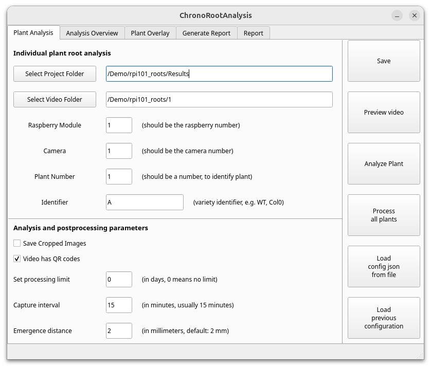

# ChronoRoot 2.0 - Standard Root Phenotyping Interface

This directory contains the Standard Root Phenotyping Interface for ChronoRoot 2.0, designed for detailed architectural analysis of individual plant root systems.



## Overview

The Standard Interface maintains continuity with the original ChronoRoot system while adding modern visualization capabilities and enhanced analysis methods. It provides tools for precise measurement of root system architecture (RSA) parameters and growth patterns through a graph-based representation approach.

## Key Features

- Detailed RSA analysis through graph-based representation
- Temporal tracking of root development
- Real-time visualization of segmentation results
- Comprehensive statistical analysis of growth patterns
- Automated report generation
- Export in Root System Markup Language (RSML) format

## Directory Structure

```
chronoRootApp/
├── analysis/                  # Core analysis modules
│   ├── graphUtils/            # Graph representation utilities
│   ├── imageUtils/            # Image processing utilities
│   ├── rsmlUtils/             # RSML export functionality
│   └── utils/                 # General utility functions
├── placeholder_figures/       # Default images for the interface
├── Screenshots/               # Interface screenshots for documentation
├── 1_analysis.py              # Plant selection and analysis workflow
├── 2_postprocess.py           # Post-processing of analysis results
├── 3_generateReport.py        # Report generation functionality
├── 4_reviewPlant.py           # Quality control and review tools
├── 5_rerun_all_analysis.py    # Batch reprocessing utility
├── calibration_helper.py      # Calibration tool implementation
├── default.json               # Default parameters
└── run.py                      # Main interface implementation
```

## Measurements Provided

The Standard Interface provides the following measurements:

### Basic Architecture
- Main Root (MR) Length
- Lateral Root (LR) Length
- Total Root (TR) Length
- Number of Lateral Roots
- Discrete LR Density
- Main Over Total Root ratio

### Growth Analysis
- Growth Speed
- Fourier Components

### Spatial Distribution
- Convex Hull Area
- Convex Hull Width
- Convex Hull Height
- Root Density
- Aspect Ratio

### Angular Measurements
- Base-Tip Angle
- Emergence Angle

## Usage

### Starting the Interface

```bash
conda activate ChronoRootInterface
python run.py
```

## Scale Calibration

The analysis pipeline converts pixel measurements to millimetres using a physical reference marker placed in the imaging frame. Two automatic marker types are supported, or a manual measurement can be entered directly.

| Marker | UI checkbox | Status | Detection method |
|--------|------------|--------|-----------------|
| **ArUco** (`DICT_4X4_250`) | *Video has ArUco markers* | Recommended for new experiments | `cv2.aruco` (built into OpenCV contrib) |
| **QR code** (1 cm encoded) | *Video has QR codes* | Legacy support for older datasets | `pyzbar` + `libzbar` |
| **Manual** | *(neither checked)* | Use when no marker is present | Enter known distance (mm) and pixel distance in the GUI |

### Selecting a calibration mode in the GUI

On the **Plant Analysis** tab there are two checkboxes just below *Save Cropped Images*:

- **Video has QR codes** — enable to auto-detect the legacy 1-cm QR code.
- **Video has ArUco markers** — enable to auto-detect an ArUco marker.

Checking either checkbox hides the *Manual Calibration Parameters* panel. Both can be enabled simultaneously; in that case ArUco is attempted first. Unchecking both reveals the manual panel, where you enter the real-world size of a known feature (*Known (mm)*) and its measured pixel span (*Pixels*), or use the *Open Calibration Helper* tool to measure interactively.

### Detection order in post-processing (`2_postprocess.py`)

For each of the first 20 image frames, the pipeline tries:

1. **ArUco detection** (if `videoHasAruco` is `true` in the config)
2. **QR detection** (if `videoHasQR` is `true` in the config)
3. Falls through to the next frame if nothing is found.

If no marker is found across all 20 frames, it falls back to the manual `knownDistance` / `pixelDistance` values, or a built-in default of 0.04 mm/pixel.

The config keys written by the UI are:

| Config key | Source checkbox |
|---|---|
| `videoHasQRbutton` / `videoHasQR` | *Video has QR codes* |
| `videoHasArucoButton` / `videoHasAruco` | *Video has ArUco markers* |

Both keys are saved in `project_config.json` for reproducibility.

### Physical marker size assumption

Both the ArUco and QR paths assume the detected marker side is **10 cm (100 mm)**. The scale factor used is:

```
pixel_size (mm/px) = 10 / aruco_get_pixel_size(corners)
pixel_size (mm/px) = 10 / get_pixel_size(qr_decode_result)
```

Ensure your printed markers match this physical size, or the resulting measurements will be scaled incorrectly.

**Printing ArUco markers:** generate a marker from the `DICT_4X4_250` dictionary using any OpenCV-compatible tool and print it at 100 mm on a side. The marker ID is not used by the pipeline — any ID in the 0–249 range is valid.

## Integration with Segmentation

This interface works with segmentation masks produced by the nnUNet module in `segmentationApp/`. For best results, ensure that videos are properly segmented before analysis.